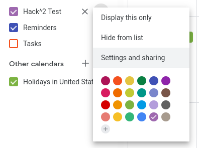
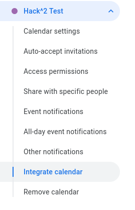
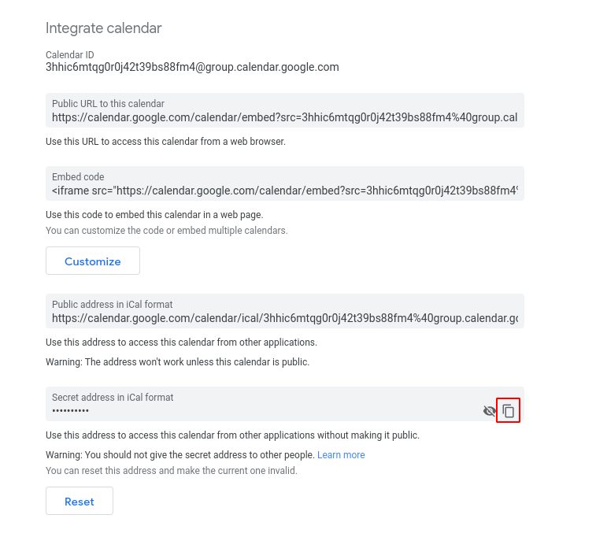

# Hacky

The Discord Bot for Hack^2

## Setup

Use npm to install the required dependencies for Hacky.

```bash
npm install
```

You will then need to configure the environment file for Hacky to run, this is where many things can be configured and customized.

Firstly, rename the ``env.example.json`` file to ``env.json``, and use the below table to guide you in configuring Hacky.

| Prop                       |  Type         | Explanation                                                                                         |
| -----------                |  -----------  | -----------                                                                                         |
| ``token``                  | ``string``    | the bot token from the discord developer portal                                                     |
| ``icon``                   | ``string``    | the icon to be used in embeds, and other places for the Hack^2                                      |
| ``calendar``               | ``string``    | the ``Secret address in iCal format`` link from Google Calendar *(more below)*                      |
| ``announcer``              | ``object``    | the object responsible for controlling the behavior of the automatic announcer                      |
| ``annnouncer.channel``     | ``string``    | the discord snowflake id of the channel automatic announcements will be sent in                     |
| ``announcer.interval``     | ``string``    | a [cron schedule](https://crontab.guru) for how often to check for updates/run the announcer        |
| ``announcer.sendDiff``     | ``number``    | a duration in milliseconds for how long before an event starts to send out an announcement          |
| ``mongo``                  | ``object``    | the object responsible for providing information on how to connect to the associated MongoDB server |
| ``mongo.username``         | ``string``    | the username to use for authentication with MongoDB                                                 |
| ``mongo.password``         | ``string``    | the password to use for authenticaiton with MongoDB                                                 |
| ``mongo.host``             | ``string``    | a URI representing the host the MongoDB is running on                                               |  
| ``mongo.port``             | ``string``    | a numeric representation of the port the MongoDB is running on                                      |  
| ``mongo.dbName``           | ``string``    | the database to select and utilize during transactions with the MongoDB                             |

### Starting Hacky

To actually start Hacky, you can simply run the following command.

```bash
npm start
```

## Setting up the Announcer with Google Calendar

To link up a Google Calendar with the announcer, it is quite a simple and straight forward process.

### Step 1

To start off, visit Google Calendars, find the calendar you would like to link, and go to the settings.



### Step 2

Next click on Settings and Sharing, and once on the settings page, click on the **Integrate Calendar** subsection.



### Step 3

Now, depending on if this is a public calendar or not, you can either you the **Public address in iCal format**, or the **Secret address in iCal format**.

In my case my this example, my calendar, ``Hack^2 Test`` is private, so I would copy the secret address.



### Step 4

Now that you have the iCal Address of your calendar, all you have to do is paste it into your ``env.json`` file, under the ``calendar`` prop and fire it up!

Upon startup, you should see a log entry under the Announcer that shows how many events it had found and loaded from your calendar. This is a good way to make sure that everything had worked.

## License
[GPL-3.0](https://choosealicense.com/licenses/gpl-3.0/)